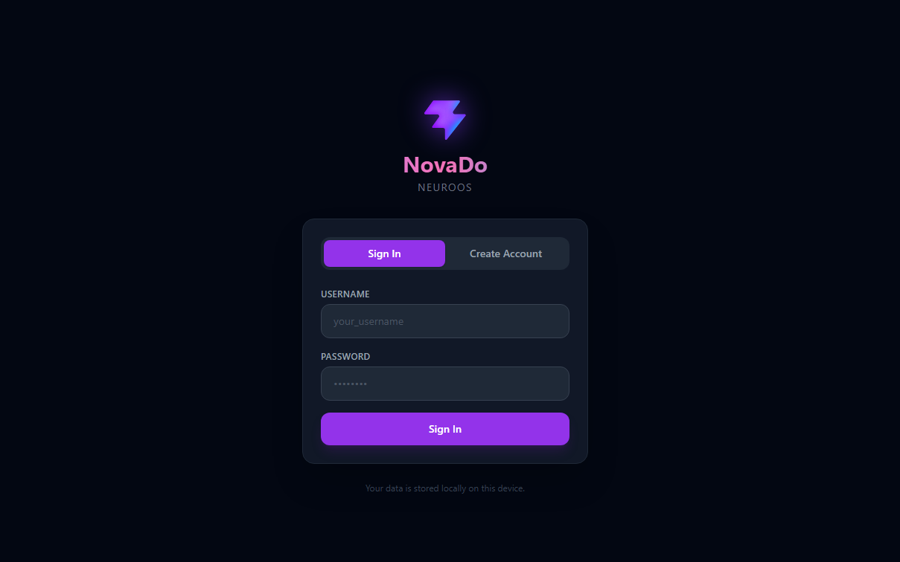
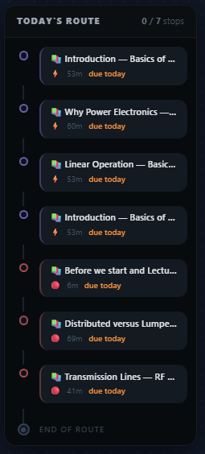
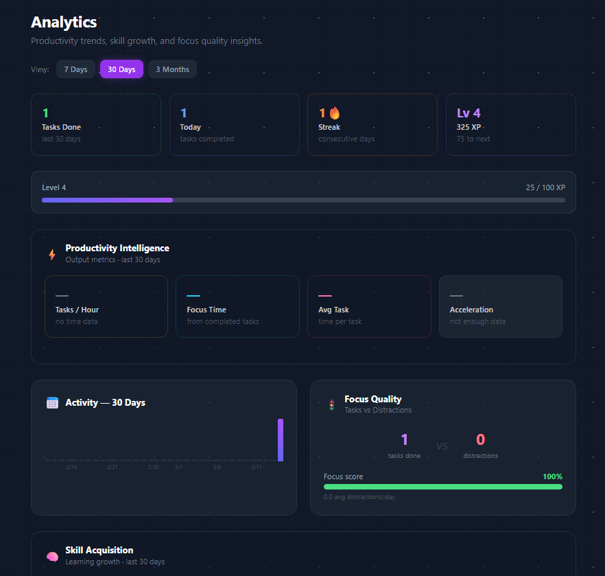
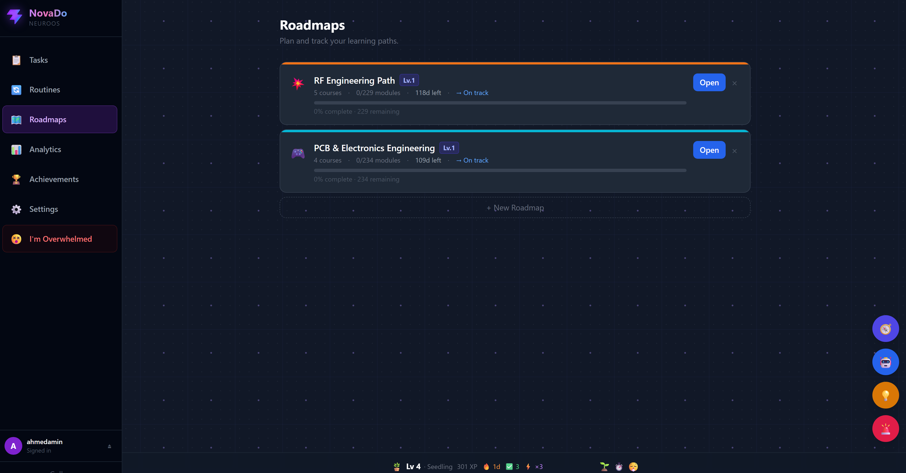
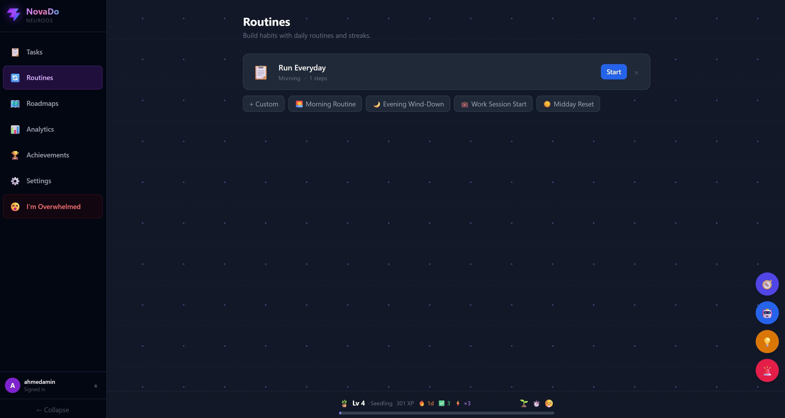
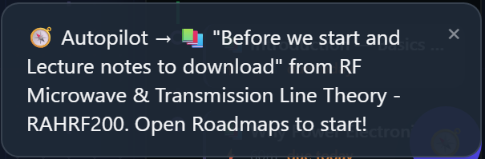
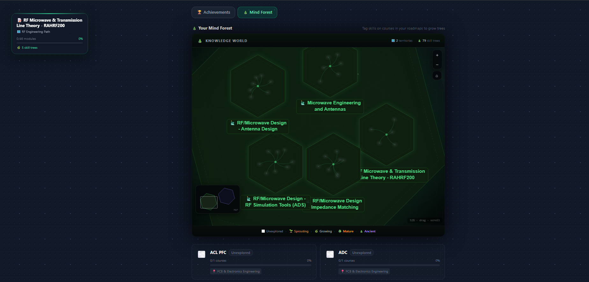
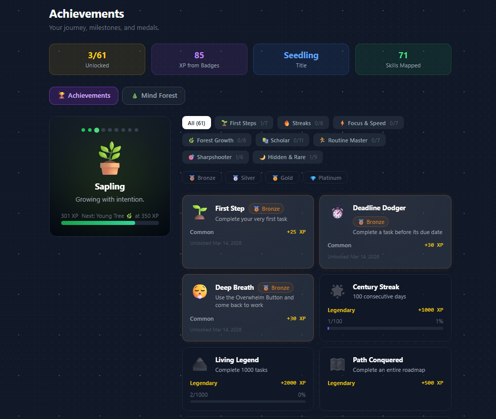
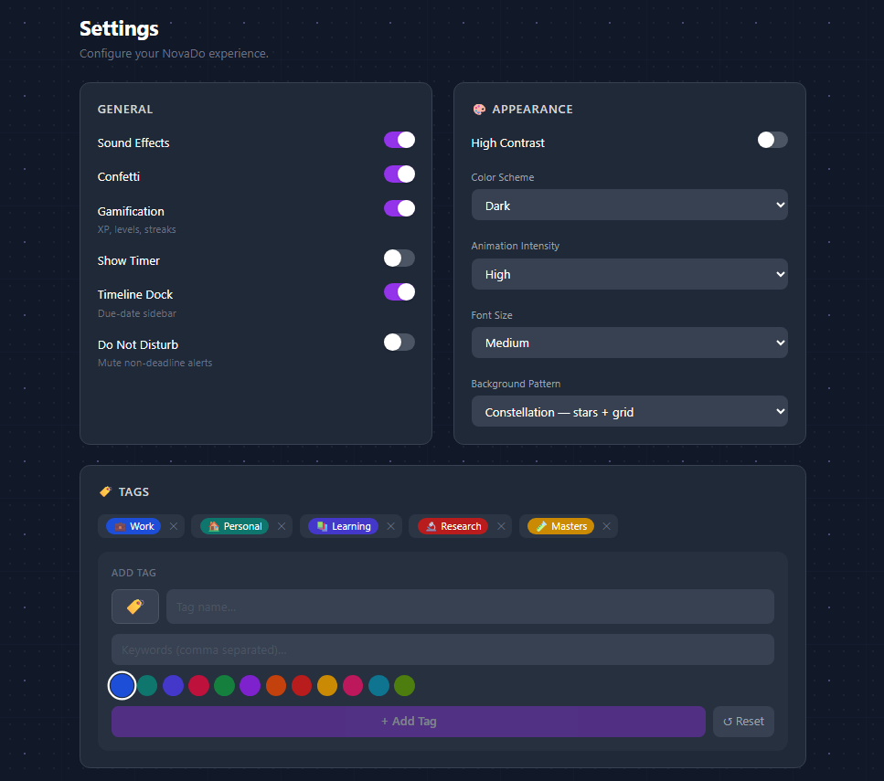

<h1 align="center">NovaDo v2</h1>
<p align="center">
  
</p>


<h3 align="center">Neuro-First Productivity OS</h3>

<p align="center">
  Built for ADHD and focus-challenged minds — NovaDo turns your work day into a<br/>
  structured, rewarding system with XP, streaks, skill trees, and an AI coach built in.
</p>

<p align="center">
  
  
  
  
</p>

<br/>

---

## Table of Contents

- [Overview](#overview)
- [Features at a Glance](#features-at-a-glance)
- [Installation](#installation)
  - [Linux / macOS](#linux--macos)
  - [Windows](#windows)
  - [Manual Setup](#manual-setup)
- [Feature Guide](#feature-guide)
  - [Local Storage Web App](#local-storage-web-app)
  - [Tasks — Metro Timeline](#tasks--metro-timeline)
  - [Analytics Dashboard](#analytics-dashboard)
  - [Roadmaps & Skill Trees](#roadmaps--skill-trees)
  - [Routines & Autopilot](#routines--autopilot)
  - [Distraction Log](#distraction-log)
  - [Mind Forest](#mind-forest)
  - [Parking Lot](#parking-lot)
  - [Achievements](#achievements)
  - [Settings & Customization](#settings--customization)
- [Keyboard Shortcuts](#keyboard-shortcuts)
- [Architecture](#architecture)
- [License](#license)

---

## Overview

NovaDo is not a to-do app. It is a **productivity operating system** designed specifically for people who need structure, momentum, and rewards built into every interaction.

Every feature is intentional:
- **Tasks feel like progress**, not a burden — XP, levels, and achievement badges reward each completion.
- **Your timeline is a metro map** — you always know what stop you're at and where you're going.
- **Your knowledge grows visually** — the Mind Forest shows every skill you're building as a living tree.
- **Distractions are captured, not ignored** — log them in two key presses, analyze them later.
- **Your data stays yours** — all storage is local, per-user, with no cloud dependency.

---

## Features at a Glance

<div align="center">

| Module | What it does |
|:------:|:------------|
| 📋 **Tasks** | Create tasks with categories, priorities, skill tags, and time tracking |
| 🚇 **Metro Timeline** | Fixed right-panel: past stops → current stop → upcoming route |
| ⚡ **XP & Levels** | Earn XP on every completion; bonuses for early delivery and hard tasks |
| 🔥 **Streaks** | Daily streak tracking with animated fire feedback |
| 🗺️ **Roadmaps** | Structured learning paths with modules; YouTube playlist import supported |
| 🔄 **Routines** | Build repeatable daily routines; run them in guided autopilot mode |
| 📵 **Distraction Log** | One-key logging of interruptions, tracked across sessions |
| 📊 **Analytics** | Time-range views (7d / 30d / 3M), acceleration metric, focus quality score |
| 🌲 **Mind Forest** | Visual knowledge graph — each skill grows from seed to ancient tree |
| 🅿️ **Parking Lot** | Quick-capture buffer for ideas not yet ready to schedule |
| 🤖 **AI Coach** | Personalized coaching based on your task and XP history |
| 🏆 **Achievements** | Milestone badges for counts, streaks, and XP thresholds |
| ⏱️ **Focus Mode** | Pomodoro + deep-work timer with ambient soundscapes |
| 🔔 **Notifications** | Smart center for streaks, achievements, and coaching nudges |
| 🎨 **Customization** | Color schemes, font sizes, animation intensity, background patterns |

</div>

---

## Installation

### Linux / macOS

```bash
# Clone the repository
git clone https://github.com/amnxlab/NovaDo-v2.git
cd NovaDo-v2

# Make the start script executable and run
chmod +x start.sh
./start.sh
```

The script automatically:
- Frees ports 3000 and 3001 if occupied
- Runs `npm install` when `node_modules` is absent
- Starts both the data server and the Vite dev server together

→ **App:** `http://localhost:3000`  
→ **API:** `http://localhost:3001`

---

### Windows

```bat
# Clone the repository
git clone https://github.com/amnxlab/NovaDo-v2.git
cd NovaDo-v2

# Double-click or run from Command Prompt / PowerShell
start.bat
```

The script automatically:
- Releases ports 3000 and 3001 if occupied
- Runs `npm install` when `node_modules` is absent (requires [Node.js](https://nodejs.org/))
- Starts both the data server and the Vite dev server together

→ **App:** `http://localhost:3000`  
→ **API:** `http://localhost:3001`

---

### Manual Setup

If you prefer to run steps individually:

```bash
# Install dependencies
npm install

# Start everything together (server + Vite)
npm run dev

# Or start them separately
npm run server    # → Express data server on :3001
npm run client    # → Vite dev server on :3000
```

> **Offline mode**: The app falls back to `localStorage` automatically when the data server is unreachable. Run `server.js` for data to persist across devices and sessions.

---

## Feature Guide

### Local Storage Web App

<p align="center">
  
</p>

---

All your data stored in local database, which gaves your privacy.

### Tasks — Metro Timeline

<p align="center">
  
</p>

Your task list is rendered as a **vertical metro line** docked to the right side:

<div align="center">

| Node type | Visual | Meaning |
|:---------:|:------:|:-------|
| Past Station | 🟢 compact row + ↩ | Completed — hover to undo |
| Current Stop | 🟡 triple-ring pulse + **CURRENT STOP** badge | The task in focus now |
| Upcoming | ◯ hollow priority-colored node | Queued in priority order |
| Terminus | ◾ small diamond | End of today's route |

</div>

**Creating a task** — click **+** or use the task input bar. Set title, category, priority, estimated duration, and skill tags.

**Completing a task** — click the checkmark. XP is awarded instantly with a pop animation. The task converts to a green Past Station on the metro line.

**Undoing a completion** — hover a Past Station and click ↩. XP is automatically reversed.

---

### Analytics Dashboard

<p align="center">
  
</p>

Switch between **7 Days**, **30 Days**, and **3 Months**. Every section updates in real time.

**Productivity Intelligence**
- Tasks per hour (active rate during focus time)
- Total focus time tracked via task timer
- Average task duration
- **Acceleration** — are you getting faster or slower over the selected period? Shown as a % change with color-coded trend direction.
- Rate-over-time micro chart, split into equal sub-periods

**Focus Quality**
- Tasks completed vs distractions logged — shown side by side
- Composite **Focus Score** (0–100%) with color coding: green ≥70, amber ≥40, red < 40

**Distraction Analysis** *(visible when logs exist)*
- Total interruptions, daily average, top trigger category
- Per-category breakdown bar chart

**Skill Acquisition** — modules completed in range, maturity distribution, course count

**Category Balance** — roadmap coverage bars with imbalance warning

**Weak Points** — courses with stalled progress (5–74% complete, not finished)

---

### Roadmaps & Skill Trees

<p align="center">
  
</p>

Build structured learning paths with **Roadmaps**:

1. Create a roadmap (e.g., *Machine Learning*, *System Design*)
2. Add courses inside it — each course can have ordered modules
3. Check off modules as you complete them — XP is awarded automatically
4. Import YouTube playlists via the **YouTube Import** button (video titles become module names)

Progress rolls up: module → course → roadmap, all visualized in the Mind Forest.

---

### Routines & Autopilot

<p align="center">
  
</p>

<p align="center">
  
</p>

Build repeatable **Routines** for morning, deep work, wind-down, or any recurring structure:

1. Create a routine and add ordered steps (tasks or actions)
2. Hit **▶ Run** to enter guided full-screen **Autopilot Mode**
3. Each step is shown one at a time — work through it, then advance
4. Completing a full routine awards bonus XP

---

### Distraction Log

<p align="center">
  
</p>

Log interruptions without breaking your focus:

- Press **D** anywhere to open the log panel (2-second interaction)
- Pick a category: Social Media, Phone, People, Thought, Hunger, Noise, Other
- Add an optional note and hit **Log**

All entries feed directly into the Analytics **Distraction Analysis** section and your **Focus Quality Score**. Over time, you identify and eliminate your biggest focus killers.

---

### Mind Forest

<p align="center">
  
</p>

A **living visual knowledge graph** — every course in your roadmaps is a tree:

<div align="center">

| Stage | Symbol | Threshold |
|:-----:|:------:|:---------:|
| Seed | 🌫️ | 0% complete |
| Sprout | 🌱 | ≥ 5% |
| Growing | 🌿 | ≥ 40% |
| Mature | 🌳 | ≥ 75% |
| Ancient | 🌲 | 100% — course complete |

</div>

Hover any tree to see its name and roadmap. Click to navigate directly.

---

### Parking Lot

<p align="center">
  
</p>

A **quick-capture buffer** for ideas and tasks that are real, but not ready for today:

- Press **I** or click the parking icon in the FAB dock
- Add a title and optional note — it parks immediately
- Return later to promote items into active tasks
- Nothing clutters your timeline; nothing gets lost

---

### Achievements

<p align="center">
  
</p>

<div align="center">

| Achievement | Trigger |
|:-----------:|:-------|
| First Step 🎯 | Complete your first task |
| Getting Started 🚀 | 10 tasks completed |
| Task Master ⚡ | 50 tasks completed |
| Century Club 💯 | 100 tasks completed |
| Early Bird 🌅 | Complete a task before its due date |
| Speed Demon ⚡ | Complete a task in under 10 minutes |
| Streak Starter 🔥 | 3-day daily streak |
| On Fire 🔥🔥 | 7-day daily streak |
| Unstoppable 💪 | 30-day daily streak |
| Level Up 📈 | Reach Level 5 |
| XP Legend 🏅 | Accumulate 1000 XP |

</div>

Each achievement triggers an animated toast notification and is permanently displayed on the Achievements page.

---

### Settings & Customization

<p align="center">
  
</p>

<div align="center">

| Setting | Options |
|:-------:|:-------|
| **Gamification** | Enable / disable XP, levels, and achievements |
| **Timeline Dock** | Show / hide the Metro right panel |
| **Focus Mode** | Pomodoro length, break intervals, ambient sounds |
| **Appearance** | Color scheme, font size, animation intensity, background pattern |
| **High Contrast** | Accessibility mode for improved readability |
| **Notifications** | System-level alert preferences |
| **Data** | Export data, clear history, fresh start |

</div>

---

## Keyboard Shortcuts

<div align="center">

| Key | Action |
|:---:|:------|
| `T` | Focus the task input bar |
| `P` | Toggle Pomodoro timer |
| `D` | Open Distraction Log |
| `I` | Toggle Parking Lot |
| `O` | Open Overwhelm modal |

</div>

---

## Architecture

```
NovaDo-v2/
├── src/
│   ├── pages/          Route-level views (TasksPage, AnalyticsPage, …)
│   ├── components/     Shared UI (TaskCard, TimelineDock, EmotionTracker, …)
│   ├── store/          Zustand stores — persisted to disk via server API
│   └── utils/          audio, autoTagger, courseParser, fileStorage, scheduler
├── data/
│   └── users/          Per-user JSON files (tasks, xp, settings, analytics, …)
├── server.js           Express API — serves and persists user store data
├── start.sh            Linux/macOS unified start script
└── start.bat           Windows unified start script
```

**State management**: All stores use Zustand v5 `persist` middleware with a custom `createFileStorage()` adapter. Writes go to `localStorage` immediately (fast), then sync to the Express server (durable). Reads prefer the server, fall back to localStorage cache.

**Auth**: JWT-based per-user sessions. Each user's data lives in `data/users/{userId}/`. No external services required.

---

## License

MIT — built for focus, designed for flow.

---

<p align="center">
  Made with ❤️ for minds that work differently.
</p>
